### python-api-challenge
# WeatherPy

# Background
Data's true power is its ability to definitively answer questions. So, let's take what you've learned about Python requests, APIs, and JSON traversals to answer a fundamental question: "What is the weather like as we approach the equator?"

Now, we know what you may be thinking: “That’s obvious. It gets hotter.” But, if pressed for more information, how would you prove that?

In this deliverable, you'll create a Python script to visualize the weather of over 500 cities of varying distances from the equator. You'll use the citipy Python library Links to an external site., the OpenWeatherMap API Links to an external site., and your problem-solving skills to create a representative model of weather across cities.

# Relationship Between Weather Variables and Latitude
## Cities in Dataframe: 565
## Latitude vs. Temperature
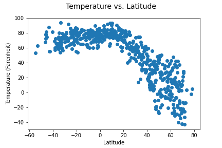

## Latitude vs. Humidity
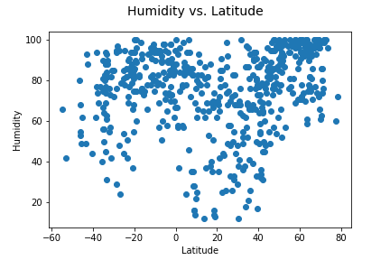

## Latitude vs. Cloudiness
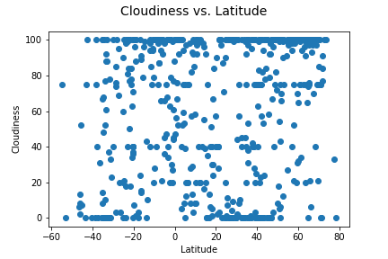

## Latitude vs. Wind Speed
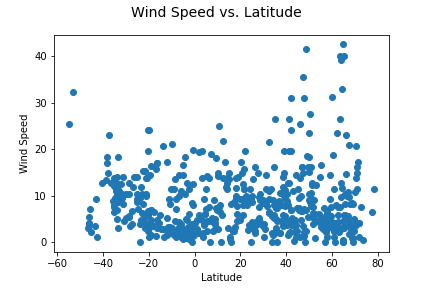

# Linear Regression for Each Relationship

## Latitude vs. Temperature
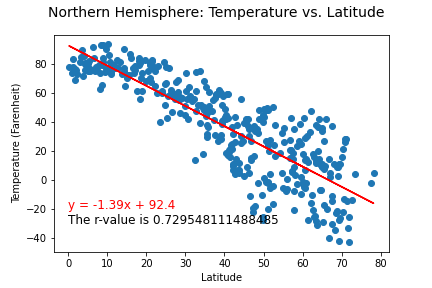
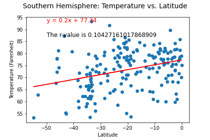

**Discussion about the linear relationship:** In the northern hemisphere, there appears to be a strong relationship between the latitude and temperature. However, in the southern hemisphere the relationship is significantly weaker.

## Latitude vs. Humidity
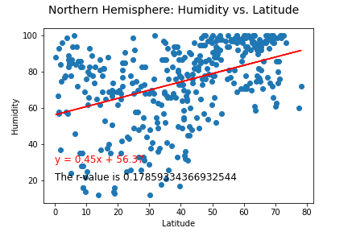
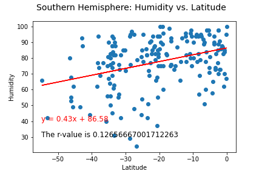

**Discussion about the linear relationship:** In both the northern and southern hemisphere, there is a very weak relationship between the latitude and the humidity levels.

## Latitude vs. Cloudiness
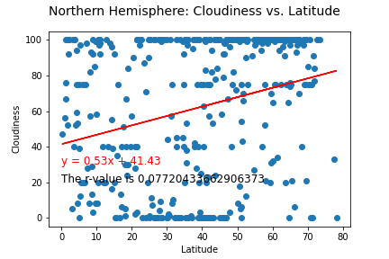
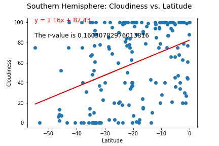

**Discussion about the linear relationship:** In the northern hemisphere, there is essentially no relationship between cloudiness and the latitude. And in the southern hemisphere, the relationship is weak, but not as small for the northern hemisphere.

## Latitude vs. Wind Speed
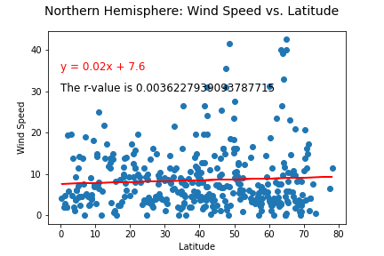
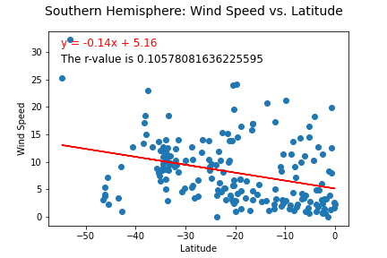

**Discussion about the linear relationship:** There is virtually no relationship at all between latitude and wind speed.
